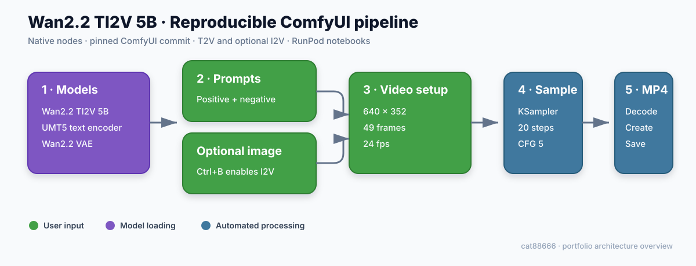

# Wan2.2 TI2V 5B — ComfyUI / RunPod reproducible workflow

[日本語](README.md) | [English](README.en.md) | [简体中文](README.zh-CN.md) | [한국어](README.ko.md)

[](https://github.com/cat88666/comfyui-wan22-runpod-portfolio/actions/workflows/validate.yml)

ComfyUI ビルダー応募用に整理した、Wan2.2-TI2V-5B の動画生成ワークフローです。テキストから動画（T2V）と、任意の入力画像から動画（I2V）の両方に対応します。



## 特徴

- ComfyUI 標準ノードのみを使用（カスタムノード不要）
- RunPod 上で `Run All` するための環境構築 Notebook
- モデルを正しいフォルダへ再開可能な形で取得する Notebook
- ComfyUI 本体をコミット単位で固定
- ユーザー操作箇所を緑、モデル部分を紫、それ以外を水色で整理
- API キーや Hugging Face Token を成果物へ保存しない設計

## 納品物

| ファイル | 内容 |
| --- | --- |
| `workflows/wan2.2_ti2v_5b_portfolio.json` | 整理済み ComfyUI workflow |
| `notebooks/Rp_run_comfyui_cat88666.ipynb` | ComfyUI 環境構築・起動 |
| `notebooks/DownLoad_Models.ipynb` | モデル取得 |
| [`docs/TEST_NOTES_JA.md`](docs/TEST_NOTES_JA.md) | 操作手順・検証記録 |
| `docs/APPLICATION_JA.md` | 応募フォーム用の文章案 |

## 想定環境

- RunPod / Linux
- Python 3.12
- CUDA 12.8
- NVIDIA GPU 8GB VRAM 以上（16GB 以上を推奨）
- 空きディスク 30GB 以上

固定している ComfyUI commit:

```text
b78cec879b9460d5cb25228a83a942fb78d2cd24
```

## RunPod での実行

1. 永続ディスクを 35GB 以上に設定して Pod を起動します。
2. JupyterLab に `notebooks/DownLoad_Models.ipynb` と `notebooks/Rp_run_comfyui_cat88666.ipynb` をアップロードします。
3. `DownLoad_Models.ipynb` を `Run All` します。
4. `Rp_run_comfyui_cat88666.ipynb` を `Run All` します。
5. RunPod の TCP/HTTP Service からポート `8188` を開きます。
6. `workflows/wan2.2_ti2v_5b_portfolio.json` を ComfyUI に読み込み、緑の領域だけを調整して Queue します。

入力画像を使う場合は、無効化されている `LoadImage` ノードを `Ctrl+B` で有効にします。T2V の場合は無効のまま実行します。

## 検証状態

JSON/Notebook の構造、コードセルの Python 構文、モデルパス、グループ色、秘密情報の混入をローカルと GitHub Actions で静的検証しています。RunPod 上の生成結果は `docs/TEST_NOTES_JA.md` に実機確認後の GPU・所要時間・出力を追記します。静的検証は GPU 上の生成成功を意味しません。

## 出典とライセンス

ワークフローは Comfy-Org の公式 Wan2.2 5B テンプレート（MIT License）を基に、低コスト検証用の解像度・フレーム数、グループ色、プロンプト、出力名を調整しています。

- [ComfyUI 公式 Wan2.2 チュートリアル](https://docs.comfy.org/tutorials/video/wan/wan2_2)
- [Comfy-Org 公式 workflow template](https://github.com/Comfy-Org/workflow_templates/blob/main/templates/video_wan2_2_5B_ti2v.json)
- Template commit: `23de45678592886158d1d97194e26d4dc59bb5b3`

元テンプレートに関する著作権・ライセンスは `THIRD_PARTY_NOTICES.md` を参照してください。本リポジトリで追加した文書と Notebook は MIT License です。
